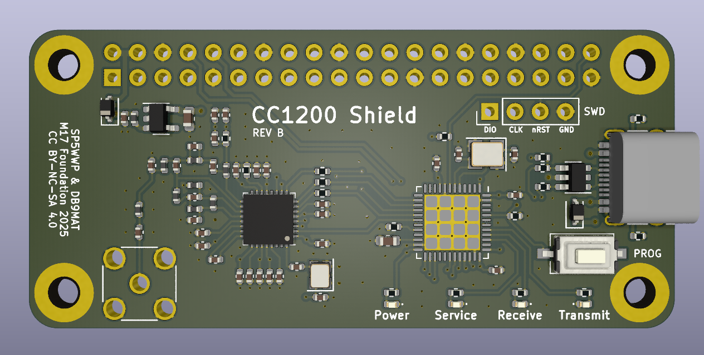

## CC1200_HAT-hw 
CC1200 RF Raspberry Pi Zero shield.

### Board overview

### Programming
See the [firmware's GitHub repository](https://github.com/M17-Project/CC1200_HAT-fw?tab=readme-ov-file#flashing)
for details.

**Note:** Programming over USB hasn't been tested yet, but should work.
